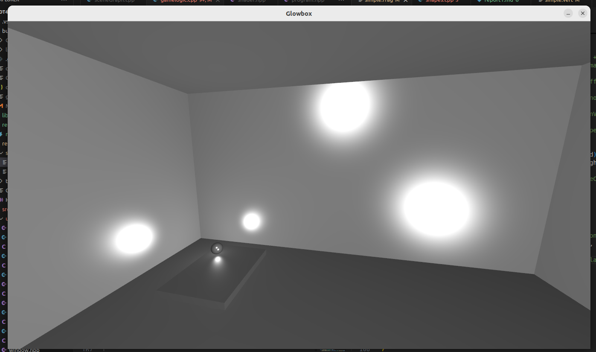
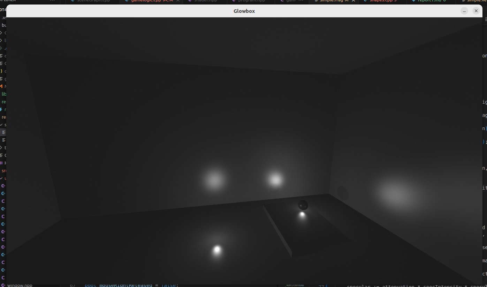
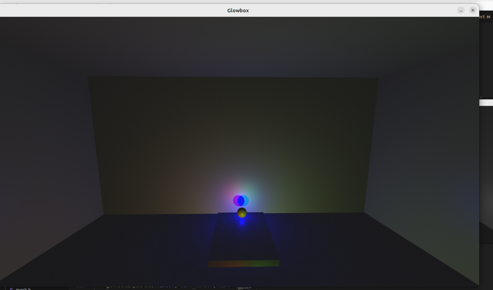
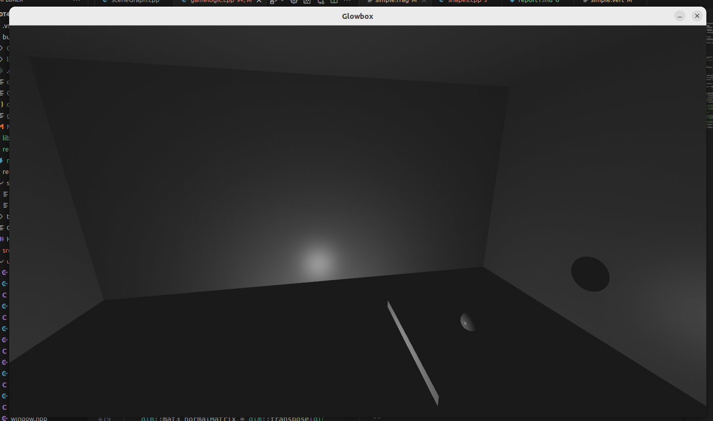
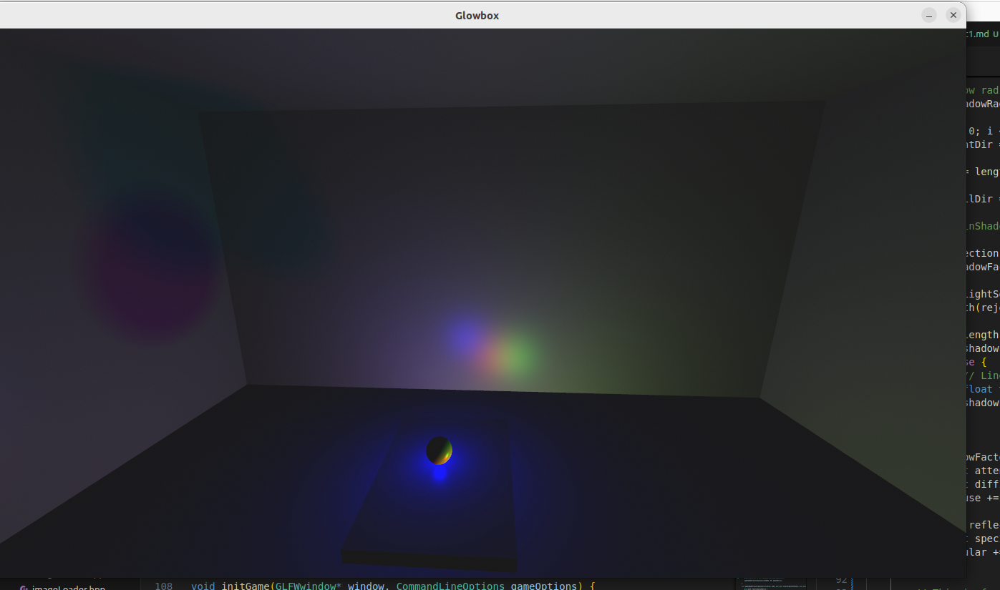

---
# This is a YAML preamble, defining pandoc meta-variables.
# Reference: https://pandoc.org/MANUAL.html#variables
# Change them as you see fit.
title: TDT4230 Assignment 1
author:
- Klein Cornolis
date: \today # This is a latex command, ignored for HTML output
lang: en-US
papersize: a4
geometry: margin=4cm
toc: false
toc-title: "Table of Contents"
toc-depth: 2
numbersections: true
header-includes:
# The `atkinson` font, requires 'texlive-fontsextra' on arch or the 'atkinson' CTAN package
# Uncomment this line to enable:
#- '`\usepackage[sfdefault]{atkinson}`{=latex}'
colorlinks: true
links-as-notes: true
# The document is following this break is written using "Markdown" syntax
---


# Report

## Task 1: 




## Task 2:



## Task 3:



The static lights have these positions on the pictures : 
{0, -60, -80}, 
{10, -60, -80}


To make sure that I did it correctly, i put the ligths on top of each other, as you can see below. If you want to check this yourslef, make sure to remove this code in gamelogic.cpp:

```cpp

    if(node->lightID == 2) { //moving light
        lightSources[node->lightID].position = glm::vec3(node->modelMatrix * glm::vec4(0, 0, 0, 1));   
    } 
    else{
        lightSources[node->lightID].position = glm::vec3(node->modelMatrix * glm::vec4(lightSources[node->lightID].position, 1)); 
    }
```




## Task 4:

I did this task, and I think I implemented it correctly. I'm attaching two pictures to show the softness, but feel free to look yourself.



