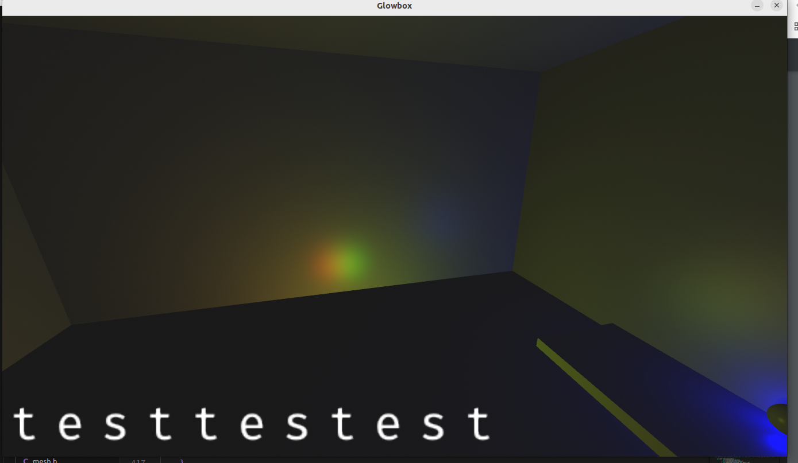
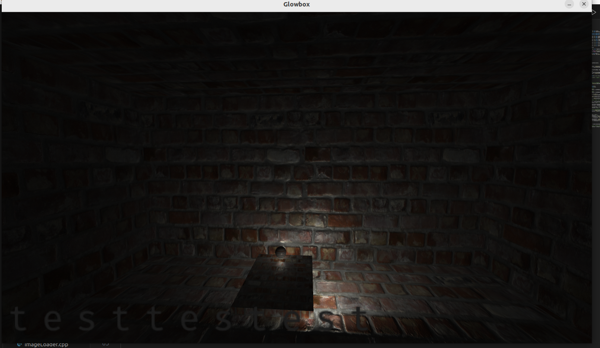
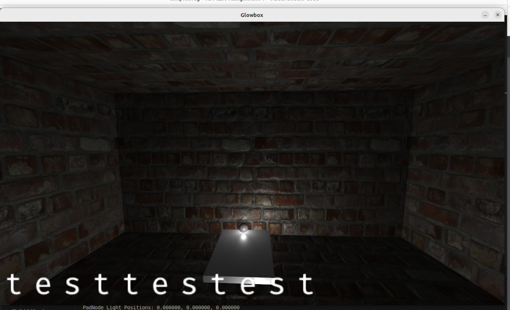
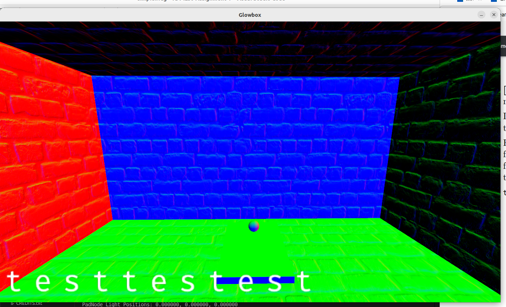

# Report

## Task 1

I made the text a bit bigger

## Task 2

### a)

The primary cause is for perspective correction. Texture coordinates are
typically specified in world space, but when we render it, it is
typically projected to 2D space. This will make objects farther away
appear smaller. To do the projection, we divide with the z-coordinate,
thus making the interpolation non-linear. If it was linear, objects
farther away can appear stretched and distorted. The reason why this
would happen is because the rate at which the texture coordinates
changes would be constant, and not account for the change in depth
variation.

### b)

1)  A displacement map maps trianlges to new positions. In our scene, we
    use a cube with 6 sides. This means that we have 12 relatively big
    triangles. If we apply the displacement map on our scene, the
    triangles will only move a bit, which will cause the sides on the
    scene to look more skewed. If the scene on the other hand consisted
    of many small triangles, we will we a much more better result with
    beter geometry. What we have done in our assignment is to use a
    trick where we use normal maps to give the geometry effect, thus not
    distorting the scene with a displacement map.

2)  We can change the scene to make the walls have more triangles.

### c)

We will expect to see a blending of the red and green. In mip-maps the
original texture map gets sampled down to smaller versions (the
mip-maps). We use a 2x2 box filter for averaging the parent texels.
Nearby, we basically use the original texture, but when we move farther
away, we use a smaller resolution mip-map which in this case blends out
the red and green.

## Task 3

### f)

### j)

Here is a picture of the normals also:

